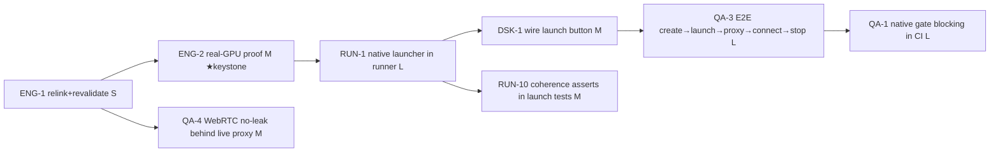
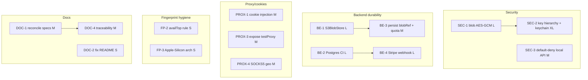

# Dependency Graph & Critical Path — Lobster Browser

> Companion to [`PROJECT-STATUS.md`](PROJECT-STATUS.md) §4–§6. Encodes what blocks what, so work is
> ordered correctly and the long-pole (real-GPU hardware) is procured first. Task IDs and priorities are
> defined in the PROJECT-STATUS master register.

## The keystone

**ENG-2 (real-GPU validation) gates the most downstream work.** Until a real-GPU score exists, every
anti-detect claim is unmeasured, all `thresholds.json` numbers are placeholders, and QA-1/4/5/6 cannot be
calibrated. **Provision the GPU host now** — it is the long-pole procurement item.

## Critical path (serial spine)

Only after this chain is any "Octo-class" statement both **defensible** (measured on real GPU) and
**exercised by shipping code** (the product launch path, not a bespoke script).

## Parallel lanes (no dependency on the GPU chain — start immediately)

## Blocks / blocked-by table

| Task | Blocks | Blocked by | Long-pole? |
|---|---|---|---|
| ENG-1 | ENG-2, QA-4 | — | no (S) |
| **ENG-2** | RUN-1, QA-1, QA-5, QA-6, ENG-8, ENG-3(pref) | ENG-1, **real-GPU host** | **YES — procure GPU now** |
| RUN-1 | DSK-1, QA-3, RUN-2, RUN-10 | ENG-1 (binary present) | no |
| DSK-1 | DSK-2, QA-3 | RUN-1 | no |
| QA-3 | v1 GA convergence | RUN-1, DSK-1, live test proxy | needs test proxy |
| QA-1 | v1 GA convergence | ENG-2 (or self-hosted GPU runner), ENG-1 | needs GPU CI runner |
| SEC-1 | SEC-1-gated sync | SEC-2 (≥ profile key) | no |
| SEC-2 | SEC-1, SEC-12 | OS keychain APIs | XL |
| SEC-3 | — (landable today) | — | no |
| BE-1 | BE-3, QA-3 durable path | MinIO in CI | no |
| BE-2 | BE-4, BE-11 | CI Postgres service | no |
| BE-4 | billing GA | BE-2, Stripe keys | needs Stripe tenant |
| ENG-7 / DSK-5 / SEC-14 | v1 **ship** | build farm + code-signing certs | **YES — procure certs + farm** |
| PROX-4 / PROX-5 | SOCKS coherence | SOCKS dependency + live proxy | needs test proxy |
| QA-6 | Octo-class KPI | ENG-2, vendor tenants, residential proxies | **YES — procure proxies/tenants** |

## Procurement long-poles (start now, in parallel with everything)

1. **A real-GPU host** (blocks ENG-2 → the whole anti-detect claim).
2. **Code-signing certificates** (Authenticode + Apple Developer ID) **+ a build farm** (blocks ENG-7 /
   DSK-5 / SEC-14 → shipping).
3. **Residential proxies + anti-bot vendor test tenants** (blocks QA-6 → the Octo-class KPI).
4. **A live test proxy with a known egress IP** (blocks QA-3 / QA-4 / PROX-4).

## Convergence for v1 GA

GPU chain green **and** SEC-1/2/3 (no plaintext, authenticated API) **and** BE-1/2 (durable) **and**
DSK-5/ENG-7 (signed installers) **and** QA-6 ≥90% against at least Cloudflare + DataDome. Everything else
is post-GA hardening (Phase D).
