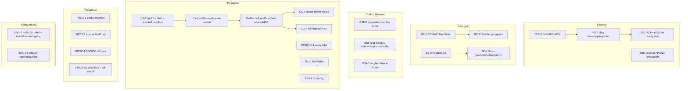

# Dependency Graph & Critical Path — Lobster Browser

> Companion to [`PROJECT-STATUS.md`](PROJECT-STATUS.md) and
> [`PRODUCTION-ROADMAP.md`](PRODUCTION-ROADMAP.md). This document orders the remaining work after the
> 2026-07-06 status reconciliation. Completed historical gates such as RUN-1 (native launcher) are kept
> out of the active critical path.

## Current Keystone

**RG-1 + HC-1..6 gate the most downstream work.** Lobium's native surfaces are built and launchable, but
they are still validated on SwiftShader/dev hardware and personas still come from `pools.ts`. A
production-grade anti-detect claim needs:

1. a real consumer-GPU baseline, and
2. host-calibrated personas derived from the user's actual machine.

Until those are green, detector thresholds, WebGL extension/precision claims, and "Octo-class" language
are placeholders.

## Active Critical Path

```mermaid
graph LR
  RG0[RG-0 provision Linux consumer-GPU box] --> RG1[RG-1 native real-GPU baseline]
  RG1 --> RG2[RG-2 triage SwiftShader vs real-GPU deltas]
  RG2 --> HC1[HC-1 host GPU probe]
  HC1 --> HC2[HC-2 host OS/screen/fonts/tz probe]
  HC2 --> HC3[HC-3 host-derived persona path]
  HC3 --> HC4[HC-4 extensions/precision/version in config]
  HC4 --> HC5[HC-5 renderer masking policy]
  HC5 --> HC6[HC-6 screen/window coherence]
  HC6 --> RG3[RG-3 cross-OS real-hardware coherence]
  RG3 --> QA1[QA-1 native real-GPU detector CI]
  QA1 --> QA3[QA-3 product E2E on clean machines]
```

RUN-1 is no longer in this graph: the native Lobium launcher exists when a binary is provided via
`LOBSTER_LOBIUM_BIN`, `LOBSTER_LOBIUM_DIR`, a local dev layout, or packaged engine resources. DSK-1 is
also no longer a pure stub: command-level launch/stop calls reach the sidecar. The
remaining desktop dependency is **integrated/product proof**: real `tauri dev`, bundled sidecar/engine,
installer, and clean-machine E2E.

## Parallel Lanes

## Blocks / Blocked-By

| Task | Blocks | Blocked by | Long-pole? |
|---|---|---|---|
| RG-0 | RG-1 | real-GPU host procurement | YES |
| RG-1 | RG-2, HC-1, QA-1 thresholds, QA-5/6 | RG-0, native binary available | YES |
| RG-2 | HC task prioritization | RG-1 | no |
| HC-1/2 | HC-3 | real-GPU baseline for production proof; probe scaffold exists, persistence/service remains | no |
| HC-3 | HC-4/5/6, RG-3 | HC-1/2 persisted host profile; `startProfile` can use a supplied host snapshot | no |
| HC-4 | RG-3, QA-5/6 | HC-1/3, native consumption of extension/precision/version fields; TS config fields exist | no |
| RG-3 | QA-1, beta detector claims | HC-1..6, all 3 OS machines | YES |
| QA-1 | beta confidence, regression gate | RG-3, self-hosted GPU runners | YES |
| QA-3 | GA convergence | DSK-2/5/11, BE-1/2, PROX live proxy, QA-1; opt-in native local E2E exists | YES |
| ENG-7/SEC-14 | signed release | build hosts, certs, rebase proof | YES |
| SEC-1/2/12 | safe sync/local storage | SEC-1 LBv1 envelope + SEC-12 field crypto done; SEC-2 key hierarchy/keychain remains | no |
| BE-1/2 | durable cloud path | MinIO/Postgres CI services | no |
| UX-1/2 | product-facing app credibility | UX-1 done; UX-2 needs engine/proxy filters + frontend E2E | no |
| DATA-UX-1 | UX-3/4, ENG-UX-1, template/proxy persistence | shared types + local SQLite partial; backend DTO/metadata and IPC remain | no |
| ENG-UX-1 | honest launch behavior for new UI controls | DATA-UX-1, HC-1..4 for GPU-derived fields | no |
| AND-0..9 | Android launchability | desktop host-calibration foundation, Android APK build, real Android devices, Android runner | YES |
| PROX-4/7/8 | proxy/fingerprint coherence | SOCKS-capable dispatcher, live proxy | needs test proxy |
| QA-6 | Octo-class KPI | RG-3, residential proxies, vendor tenants | YES |

## Procurement Long-Poles

1. **Linux consumer-GPU box** for RG-0/RG-1.
2. **Windows laptop/iGPU + Apple Silicon Mac** for RG-3 cross-OS proof.
3. **Code-signing certificates** and per-OS build hosts for ENG-7/SEC-14.
4. **Residential proxies + anti-bot vendor test tenants** for QA-6.
5. **Known-egress live test proxy** for QA-3/QA-4/PROX-4.

## Convergence For Beta / GA

Private beta needs: RG-3 + QA-1 green, host-calibrated personas, command-level desktop launch proven in
an integrated GUI run, encrypted sync, durable backend, and at least one signed/bundled installer path.

GA needs: signed installers for supported OSes, updater, native detector CI, product E2E, live
anti-bot trends, Postgres/S3/Stripe production paths, observability, and documented operating runbooks.
